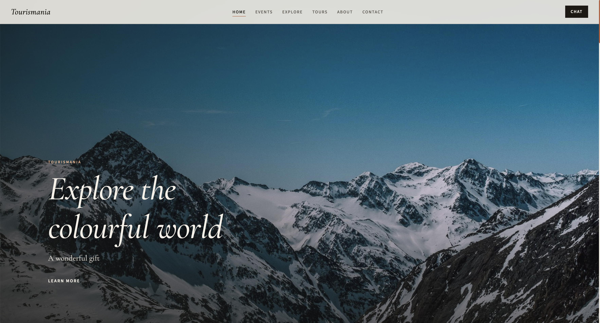
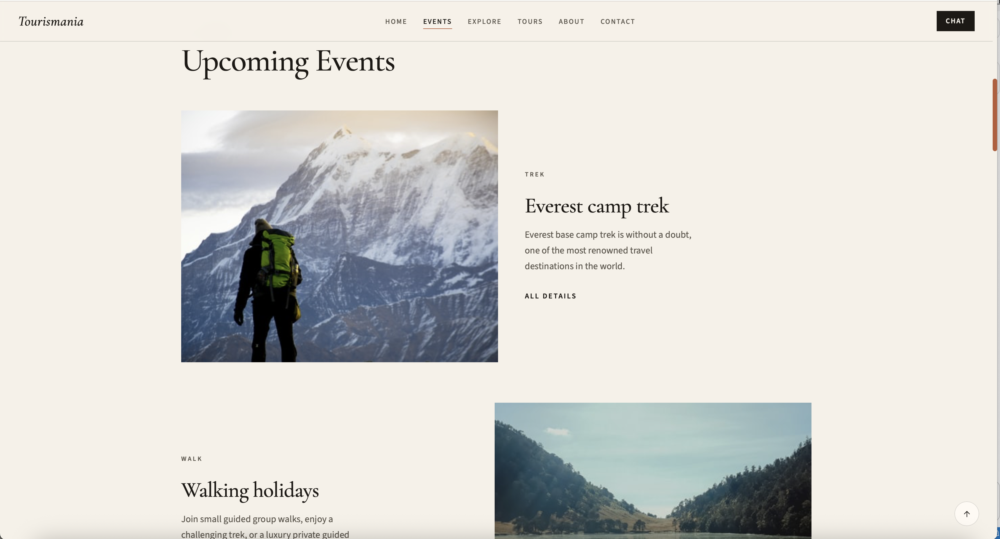
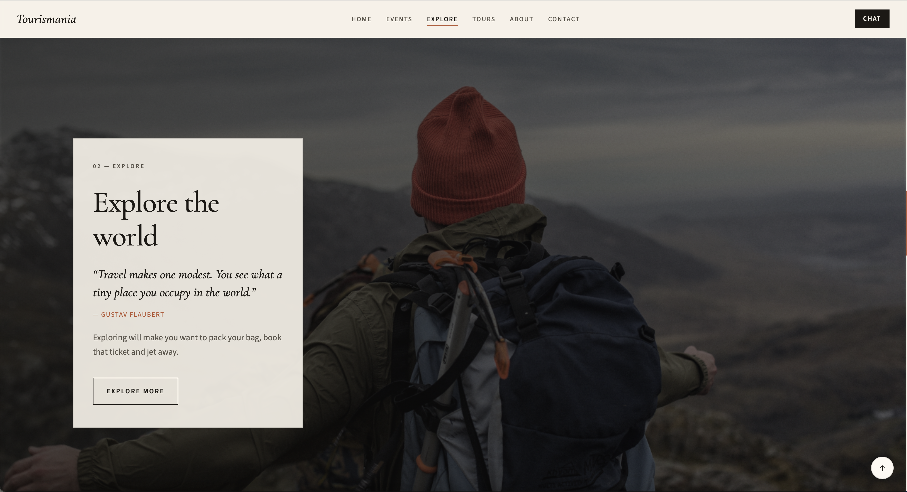
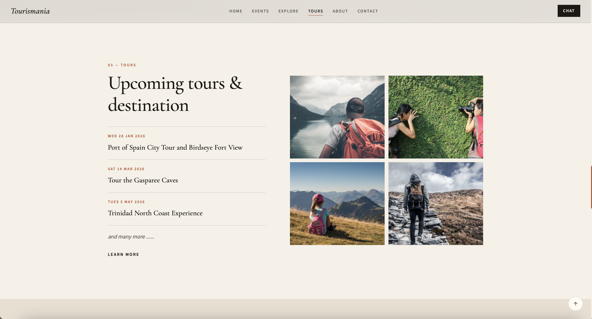

# Tourismania

A single-page travel journal for upcoming events, tours, and destinations. Built with HTML, CSS, and JavaScript.

## About

Tourismania is a static tourism site: browse trips, read a short journal of why to travel, and reach the desk by email or chat.

- Pure HTML, CSS, and JavaScript — no framework and no backend
- Editorial layout with cream, ink, and terracotta styling
- Runs locally; open `index.html` or serve the folder

## Preview

### Home



### Events



### Explore



### Tours



## Features

- **Home** — Full-bleed hero with the Tourismania wordmark
- **Events** — Everest camp trek, walking holidays, and Andaman Beaches
- **Explore** — Travel quote and call to explore
- **Tours** — 2026 itinerary (January–May) with a photo gallery
- **About** — Image carousel and a short brand note
- **Why Tourismania** — Guided trips, small groups, and destinations
- **Contact** — Message form and `tourismania@gmail.com`
- **Chat** — Talk with Amara, Tourismania Official, from the nav or the contact card

## Run locally

From the project folder:

```bash
python3 -m http.server 8765
```

Then open [http://127.0.0.1:8765/](http://127.0.0.1:8765/).

You can also open `index.html` directly in a browser.

## License

This project is licensed under the MIT License. See [LICENSE](LICENSE) for details.
